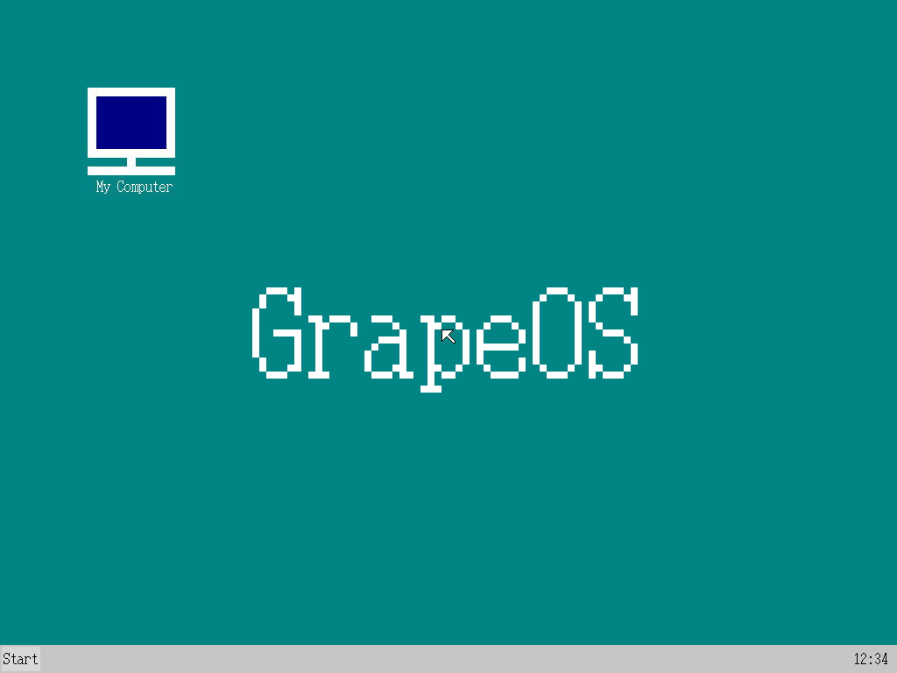
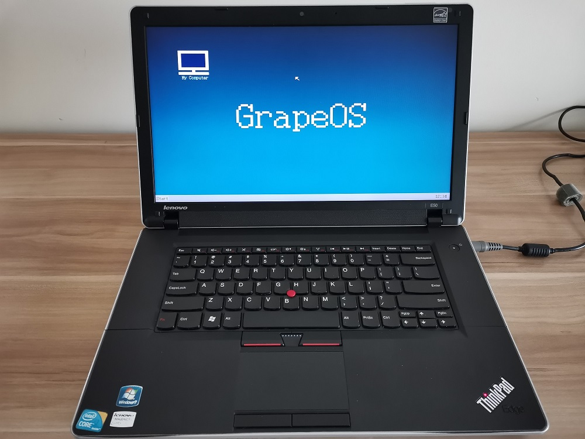
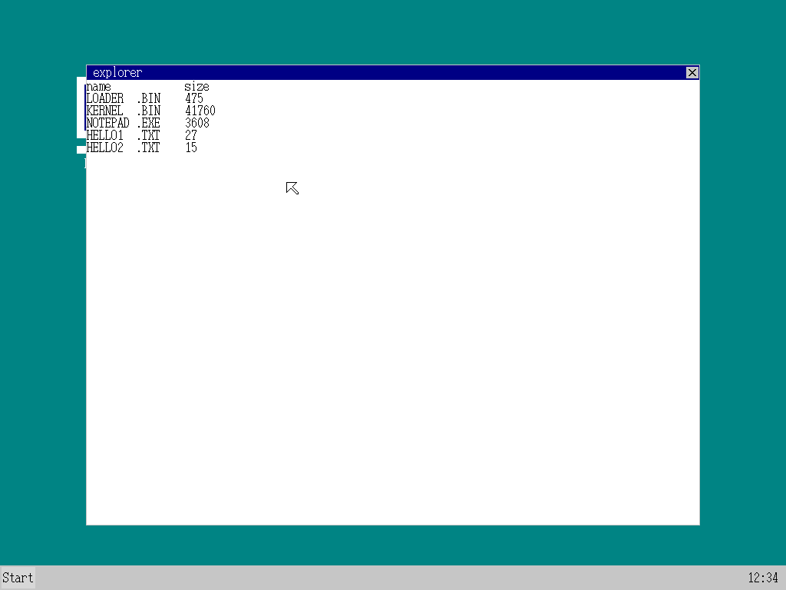
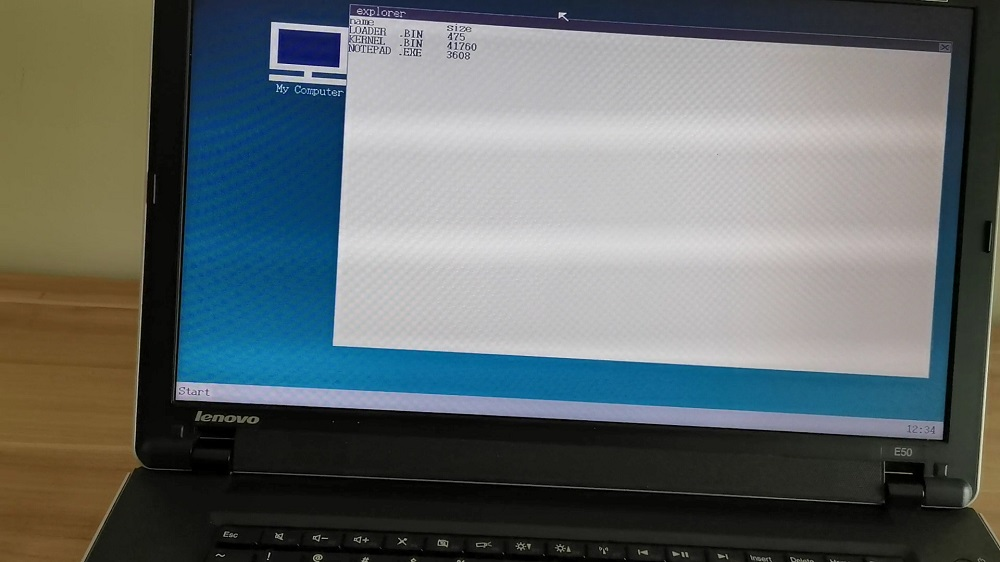
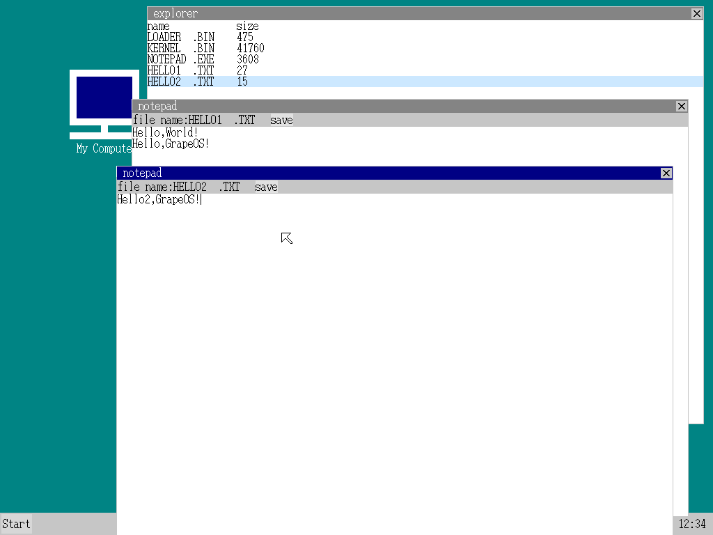
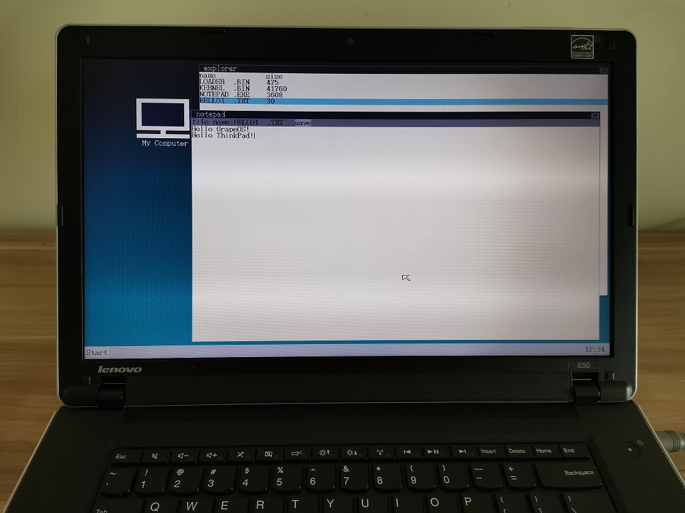

# GrapeOS操作系统
## 简介
学习操作系统原理最好的方法是自己写一个简单的操作系统。  
GrapeOS是一个非常简单的x86多任务桌面操作系统，源代码只有四千行，非常适合用来学习操作系统原理。    
视频教程地址：https://www.bilibili.com/video/BV1nv4y1b7Nj/  
课程讲义地址：https://www.cnblogs.com/chengyujia/category/2279524.html  
GrapeOS操作系统QQ1群：643474045（已满）QQ2群：123758575  
## 截图
### GrapeOS桌面：
  
  
### GrapeOS资源管理器：
  
  
### GrapeOS记事本：
  
  
## 主要知识点
实模式  
保护模式  
大分辨率画面模式  
磁盘及文件系统  
内存分页  
内存管理  
中断管理  
定时控制  
键盘控制  
鼠标控制  
消息机制  
图形绘制  
图层和窗口管理  
多任务管理  
内核任务  
用户任务  
进程与线程  
系统调用  